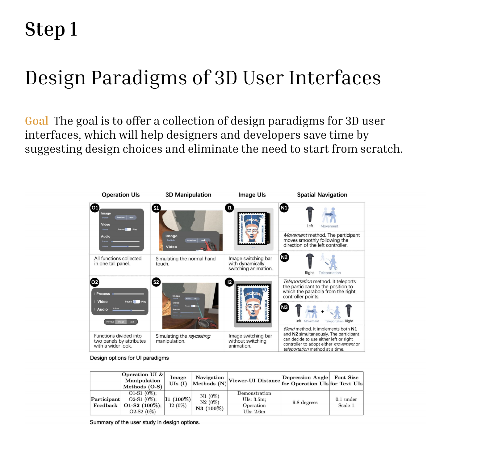

# A-Design-System-for-Automatic-Layout-Optimisation-of-Peripheral-UIs-for-Extend-Reality-XR-Exhibits

Originating from this work, ['Design Paradigms of 3D User Interfaces for VR Exhibitions'](https://dl.acm.org/doi/10.1007/978-3-031-42283-6_33) was successfully published at Interact 2023

